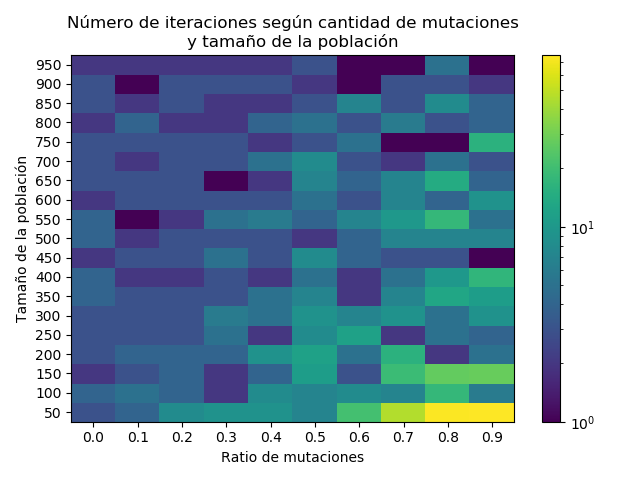
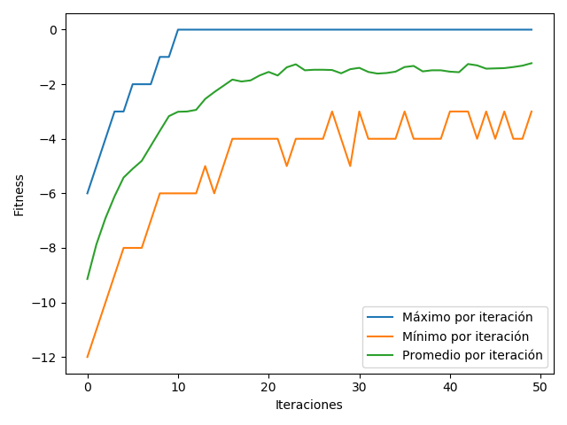

# Red Neuronal

Proyecto hecho para la tarea 2 del ramo _Redes Neuronales y Programación Genética_. Permite crear algoritmos genéticos para adivinar palabras formadas por símbolos binarios (1s y 0s), frases formadas con letras, y para encontrar la salida de laberintos.

## Ejecución

Para ejecutar el programa, primero es necesario instalar sus requisistos. Esto se puede hacer desde esta misma carpeta, corriendo el comando

```
pip install requirements.txt
```

Luego, se pueden correr los experimentos con el siguiente comando:

```
python -{tipo_gráfico} {tipo_problema}
```

`{tipo_gráfico}` puede ser _heatmap_ o _evolution\_graph_,  dependiendo del gráfico que se quiere generar.

`{tipo_problema}` puede ser _binary_, _alphabetic_ o _maze_, dependiendo de si se quiere crear una población que adivine una palabra en binario, un texto con letras y espacios, o encontrar la salida de un laberinto. Los dos primeros corresponden a los ejercicios vistos en clases, mientras que el tercero es el problema elegido para el desarrollo de la tarea.

## Elección del problema

El problema elegido fue el de encontrar la salida de un laberinto, pues al ser un problema con el que se tenía más familiaridad, se consideró que sería más fácil de modelar.

Para modelarlo se consideraron dos posibilidades. Primero, se evaluó evaluar el fitness del individuo según su distancia a la salida (considerando los caminos válidos), y codificar el camino tomado en sus genes.

Como el camino tomado se podía codificar como un _string_ de las direcciones en las que se avanzaba en cada paso, lo que se hizo finalmente fue guardar este _string_ como el gen de los individuos, y para el fitness se utilizó el mismo que se usó para los demás problemas: la distancia de Levenshtein entre el camino tomado y el de una ruta válida (codificada como string).

Para la implementación, se creó una clase abstracta _GeneticAlgorithm_, que implementa la selección, crossover y mutación de genes. Luego, se tiene la clase _StringProblemGeneticAlgorithm_, que además tiene funciones para evaluar la _fitness_, ver si se encontró una solución, y generar un individuo. Para todos los problemas, los individuos se describen sólo a través de sus genes, que corresponden a un _string_.

Luego, se creó la clase _LabyrinthGeneticAlgorithm_, que hace un _override_ del método que hace la mutación. Esto es porque para los problemas anteriores se consideraron palabras de largo fijo. Para la solución a un laberinto, esto no tiene mucho sentido, porque pueden haber caminos de largo distinto.

## Análisis

### Implementación

En cuanto a la implementación, utilizar una clase abstracta como base la simplificó bastante. La parte más difícil de implementar fue el laberinto en sí.

En cuanto a la utilidad de los algoritmos genéticos implementados, esta no es mucha, porque se ajustan solo a problemas específicos, y que al reducirse solo a encontrar un string, no es fácil pensar en una utilidad que vaya más allá de estos problemas en específico. Con esto no se quiere decir que los algoritmos genéticos no sirvan para nada, si no que cada uno en particular tiene su utilidad limitada solo al problema para el que se entrenaron, y no es trivial extender su uso.

### Resultados

Para el análisis, se revisarán los resultados para el caso de palabras en binario, pues según las pruebas preliminares, el problema demora menos en correr, y los resultados no varían tanto entre problemas.



En el heatmap se puede ver que, en general, mientras más grande es la poblcación, menos tiempo se demora en encontrar una solución. Esto es porque al generar la población inicial, hay una mayor cantidad de individuos con mayor fitness, por lo que es más probable que sean elegidos por el algoritmo de selección (se implementaron la ruleta y el torneo, pero finalmente se utilizó solo el torneo, porque generaba mejores resultados).

Además, se puede ver que cuando hay muchas mutaciones, hacen falta más iteraciones para que el algoritmo encuentre una solución, esto se puede deber a que cuando hay muchas mutaciones, los individuos nuevos son más "aleatorios", y hay menos probabilides de que mantengan los genes de sus padres que coinciden con el de la palabra buscada.




El gráfico de fitness se generó con una población de 100 individuos, y con una tasa de mutación de 0.1. Para este caso, el algoritmo se demora aproximadamente 10 iteraciones en encontrar una iteración. Además, durante las primeras 10 iteraciones, el mínimo y el promedio mejoran rápidamente. Este comportamiento se puede deber a que el algoritmo de selección (torneo), es bastante efectivo para elegir buenos individuos.